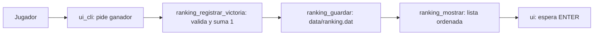

# Batalla Naval (ANSI C)

Juego de Batalla Naval en C estandar (ANSI C / C89), interfaz de consola.
Trabajo final de Algoritmica y Programacion I.

## Integrantes y aportes

| Integrante | Modulo | Aporte |
|---|---|---|
| 1 | Tablero y colocacion (`board.c`, parte de `game.c`) | TODO |
| 2 | Flujo e interfaz consola (`app.c`, `ui_cli.c`) | TODO |
| 3 | IA (`ai.c`) | TODO |
| 4 | Ranking, datos y compilacion (`ranking.c`, `config.h`, `Makefile`) | Ranking portable en `data/ranking.dat`, config y Makefile |

## Reglas y alcance

- Tablero 10x10, 5 barcos por jugador (5, 4, 3, 2, 1). Ver `include/config.h`.
- Colocacion manual horizontal/vertical, sin salir del tablero ni superponerse.
- Modos: jugador vs jugador y jugador vs maquina.
- Gana quien hunde toda la flota rival.
- Al finalizar: se suma 1 victoria al ganador en `data/ranking.dat`, se muestra
  el ranking ordenado (victorias desc, luego nombre asc) y se espera ENTER.
- Nombres que solo difieren en mayusculas son el mismo jugador.
- Detalle del contrato en `docs/contrato-ranking.md`.

## Compilacion y ejecucion

Requisito: GCC o Clang y `make`.

```sh
# Desde la raiz del proyecto (donde estan Makefile y data/)
make
./build/test_ranking
./build/demo_ranking "Ana"
cat data/ranking.dat
```

El programa SIEMPRE se ejecuta desde la raiz, porque la ruta del ranking es
relativa: `data/ranking.dat` (ver `CONFIG_RANKING_RUTA`).

### Linux

```sh
sudo apt install gcc make
make
make test
```

### Windows

Opcion verificada: LLVM-MinGW + Git Bash:

1. Instalar LLVM-MinGW (o MinGW-w64 con `gcc` y `make`).
2. Abrir Git Bash en la carpeta del proyecto.
3. `mingw32-make CC=clang` y `mingw32-make CC=clang test` como en Linux.
   (Con MinGW-w64 clasico, `mingw32-make` con `CC=gcc` por defecto.)

Sin `make`, compilacion manual (cmd o PowerShell con clang/gcc en PATH):

```bat
mkdir build
clang -ansi -pedantic -Wall -Wextra -Iinclude tests/test_ranking.c src/ranking.c -o build/test_ranking.exe
clang -ansi -pedantic -Wall -Wextra -Iinclude src/demo_ranking.c src/ranking.c -o build/demo_ranking.exe
build\test_ranking.exe
build\demo_ranking.exe "Ana"
```

## Organizacion de datos y funciones

```
include/  ranking.h  contrato con app/ui (actualizar, consultar, guardar)
          config.h   tablero y flota configurables, ruta del ranking
src/      main.c         punto de entrada (minimo)
          ranking.c      logica + persistencia del ranking (sin UI)
          demo_ranking.c ejemplo de integracion fin-de-partida
          app.c, ui_cli.c, game.c, board.c, ai.c  (TODO otros integrantes)
data/     ranking.dat  formato texto "nombre;victorias" (portable, sin fwrite)
tests/    test_ranking.c  pruebas sin frameworks (codigos de retorno)
docs/     contrato-ranking.md
```

Separacion (Anexo A): `ranking.c` valida, ordena y persiste; `ui_cli.c`
pide nombres y muestra mensajes via `ranking_mensaje_error`. Recorrido:
jugador -> interfaz -> `ranking_registrar_victoria` -> interfaz consulta
con `ranking_cantidad`/`ranking_obtener` -> pantalla.



## Estado del modulo ranking

- [x] `ranking.h` / `ranking.c` en ANSI C, solo stdio/string/ctype.
- [x] Formato texto portable, informa errores de lectura/escritura.
- [x] `make test` con 30+ aserciones (orden, mayusculas, formato, lleno, roundtrip).
- [x] `demo_ranking` demuestra el flujo exigido por la consigna.
