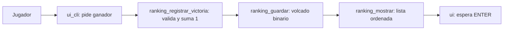

# Batalla Naval (ANSI C)

Juego de Batalla Naval en C estandar (ANSI C / C89), interfaz de consola.
Trabajo final de Algoritmica y Programacion I.

## Integrantes y aportes

| Integrante | Modulo | Aporte |
|---|---|---|
| 1 | Tablero y colocacion (`tablero.c`, parte de `app.c`) | TODO |
| 2 | Flujo e interfaz consola (`app.c`, `ui_cli.c`) | TODO |
| 3 | IA (`ai.c`) | TODO |
| 4 | Ranking, datos y compilacion (`ranking.c`, `config.h`, `Makefile`) | Ranking binario (volcado del struct) en `data/ranking.dat`, config y Makefile |

## Reglas y alcance

- Tablero 10x10, 5 barcos por jugador (5, 4, 3, 2, 1). Ver `include/config.h`.
- Colocacion manual horizontal/vertical, sin salir del tablero ni superponerse.
- Modos: jugador vs jugador y jugador vs maquina.
- Gana quien hunde toda la flota rival.
- Al finalizar: se suma 1 victoria al ganador en `data/ranking.dat`, se muestra
  el ranking ordenado (victorias desc, luego nombre asc) y se espera ENTER.
- Nombres que solo difieren en mayusculas son el mismo jugador.
- El ranking se guarda en **binario**: un volcado directo del struct
  `Ranking` (3604 bytes), sin magic, version ni checksum.
- Detalle del contrato y limitaciones en `docs/contrato-ranking.md`.

## Compilacion y ejecucion

Requisito: GCC o Clang y `make`. El objetivo de compilacion es **Linux**
(probado en WSL/Ubuntu con GCC 15 y GNU Make 4.4; tambien verificado en
Windows con LLVM-MinGW 22).

```sh
# Desde la raiz del proyecto (donde estan Makefile y data/)
make                # compila build/test_ranking y build/demo_ranking
make test           # 68 aserciones del modulo ranking
make demo           # recuerda como correr la demo

./build/demo_ranking "Ana"
ls -l data/ranking.dat     # 3604 bytes
```

El programa SIEMPRE se ejecuta desde la raiz, porque la ruta del ranking es
relativa: `data/ranking.dat` (ver `CONFIG_RANKING_RUTA`).

### Linux / WSL

```sh
sudo apt install gcc make
make
make test
```

Si usas WSL, copia el proyecto dentro del filesystem de Linux (no lo ejecutes
desde `/mnt/c`, para evitar problemas de permisos y rendimiento):

```sh
cp -r /mnt/c/Users/gican/Desktop/UNI_projects/demo-batallanaval ~/UNI_projects/demo-batallanaval
cd ~/UNI_projects/demo-batallanaval
make
make test        # 68/68 OK
```

Para trabajar desde VS Code: instala la extension **WSL**, luego
`Ctrl+Shift+P` -> `WSL: Connect to WSL` y abri la carpeta del proyecto.
`build/` esta ignorado en git.

### Windows

Compatible con LLVM-MinGW (clang). Compilacion manual desde Git Bash:

```sh
clang -ansi -pedantic -Wall -Wextra -Iinclude tests/test_ranking.c src/ranking.c -o build/test_ranking.exe
clang -ansi -pedantic -Wall -Wextra -Iinclude src/demo_ranking.c src/ranking.c -o build/demo_ranking.exe
./build/test_ranking.exe
./build/demo_ranking.exe "Ana"
```

La verificacion oficial sigue siendo Linux; en Windows el modo binario
`"wb"`/`"rb"` es obligatorio para que los enteros no se corrompan.

## Organizacion de datos y funciones

```
include/  ranking.h  contrato con app/ui (actualizar, consultar, guardar)
          config.h   tablero y flota configurables, ruta del ranking
src/      main.c         punto de entrada (integracion pendiente)
          ranking.c      logica + persistencia binaria (sin UI)
          demo_ranking.c demo de fin de partida
          app.c, ui_cli.c, tablero.c   (otros integrantes)
data/     ranking.dat  volcado binario del struct (no editar a mano)
tests/    test_ranking.c  pruebas sin frameworks (codigos de retorno)
docs/     contrato-ranking.md
```

Separacion (Anexo A): `ranking.c` valida, ordena y persiste; `ui_cli.c`
pide nombres y muestra mensajes via `ranking_mensaje_error`. Recorrido:
jugador -> interfaz -> `ranking_registrar_victoria` -> interfaz consulta
con `ranking_cantidad`/`ranking_obtener` -> pantalla.


```mermaid
flowchart LR
  J[Jugador] --> UI[ui_cli: pide ganador]
  UI --> RK[ranking_registrar_victoria: valida y suma 1]
  RK --> SV[ranking_guardar: volcado binario]
  SV --> MO[ranking_mostrar: lista ordenada]
  MO --> UI2[ui: espera ENTER]
```

## Formato del archivo (resumen)

```
offset 0     3600 bytes   100 entradas x 36 bytes
                          +0  char nombre[32]
                          +32 int  victorias
offset 3600     4 bytes   int cantidad (0..100)
TOTAL        3604 bytes
```

- Se escribe con `fwrite` de una copia normalizada a ceros del struct.
- Se lee con `fread` y se valida: tamano exacto, `cantidad`, `'\0'` en
  cada nombre y rango de victorias.
- Sin checksum no se detecta un byte alterado que siga siendo valido.
  Ver "Modelo de amenaza" en `docs/contrato-ranking.md`.

## Estado del modulo ranking

- [x] `ranking.h` / `ranking.c` en ANSI C, solo stdio/string/ctype.
- [x] Formato binario (volcado del struct), lectura validada y guardado
      deterministico (los bytes libres siempre quedan en cero).
- [x] Asserts de compilacion para detectar padding/cambios de layout.
- [x] `make test` con 68 aserciones (formato, corrupcion, carga parcial,
      orden, mayusculas, capacidad, errores de API y roundtrip).
- [x] `demo_ranking` demuestra el flujo exigido por la consigna.
- [ ] `make app`: integracion completa pendiente; `app.c`, `ui_cli.c` y
      `tablero.c` todavia no compilan en `-ansi`.
